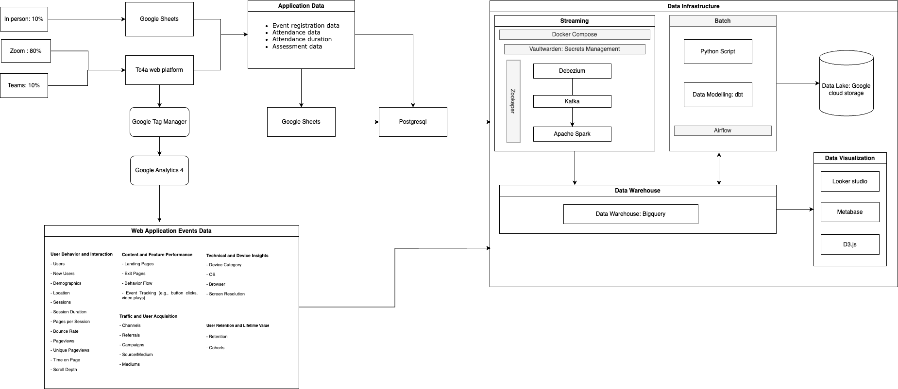

# **CoriSync Data Platform**

## **Overview**

The **CoriSync** data platform is designed to enable real-time data streaming, transformation, and analysis across tc4a services. The platform will integrate with multiple data sources, perform real-time data processing, and enable analytics via **BigQuery**. The system will be powered by **Debezium**, **Kafka**, **Apache Spark**, **DBT**, and various other tools to handle large volumes of data efficiently.

---


## **Architecture Overview**

The CoriSync platform integrates real-time data pipelines using various tools, each playing a specific role in the process. Below is the breakdown of the core components:

### **Data Sources**
- **PostgreSQL**: The primary source for operational data, which will be used with **Debezium** for Change Data Capture (CDC).
- **Web Analytics Data**: Includes data from web platforms (such as user interactions, log data, and events) that are streamed in real-time.
- **Google Sheets**: Includes data from in person trainings.

### **Data Streaming and Transformation**
- **Debezium**: Captures real-time data changes from **PostgreSQL** using logical replication and streams the data to **Kafka**.
- **Kafka**: Acts as the messaging system for real-time data streaming, allowing the data to be consumed by downstream services.
- **Apache Spark**: Processes and transforms the streamed data from Kafka, allowing analytics and transformations in real time.
- **DBT**: Executes data transformations and modeling as part of the ETL pipeline, ensuring the data is structured and ready for analytics.
- **Airbyte**: Handles data integration and movement, syncing data from multiple sources.
- **BigQuery**: The final destination for processed data, where it is stored and available for querying and analysis.

### **Data visualization**
- **Looker studio**: Currently being used for creating visualizations for the main dashboard inside the tc4a web platform.
- **Metabase**: Opensource viz tool for more custom analytics outside the webplatform, this can also be embedded into the webplatform.
- **D3.js**: Implementing visualizations inside the tc4a web platform.

### **Tools and Services**
- **Airflow**: Orchestrates workflows and manages DAGs to automate tasks like data loading, transformations, and scheduling.
- **Zookeeper**: Manages configuration and synchronization of distributed services (used by Kafka and Debezium).
- **Vaultwarden**: Securely manages secrets and credentials needed by services.
  
---

## Folder Structure

```plaintext
project-root/
├── docker-compose.yml                # Main compose file
├── services/
│   ├── airflow/
│   │   ├── docker-compose.airflow.yml
│   │   ├── entrypoint.sh
│   │   ├── init_config.sh
│   │   ├── metrics.ini
│   │   ├── prometheus.yml
│   │   ├── promtail-config.yml
│   │   ├── requirements.txt
│   │   ├── statsd_mapping.yml
│   │   ├── Readme.md
│   │   ├── Dockerfile
│   │   ├── dags/
│   │   │   ├── dbt/                     # DBT-related files (models, transformations)
│   │   │   └── dags/                    # Airflow DAGs related to data tasks
│   │   ├── logs/                        # Airflow logs directory
│   │   └── plugins/                     # Airflow plugins directory
│   ├── kafka/
│   │   └── docker-compose.kafka.yml     # Kafka Docker Compose configuration
│   │   ├── Readme.md
│   ├── vaultwarden/
│   │   └── docker-compose.vaultwarden.yml
│   │   ├── Readme.md
│   ├── zookeeper/
│   │   └── docker-compose.zookeeper.yml  # Zookeeper Docker Compose configuration
│   │   ├── Readme.md
│   ├── debezium/
│   │   ├── docker-compose.debezium.yml   # Debezium Docker Compose configuration
│   │   ├── debezium-postgresql-connector.json  # PostgreSQL connector configuration for Debezium
│   ├── apache-spark/
│   │   └── docker-compose.spark.yml
│   │   ├── Readme.md
│   ├── airbyte/
│   │   └── docker-compose.airbyte.yml
├── terraform/                         # Terraform configurations
│   ├── aws/
│   │   ├── main.tf
│   │   ├── variables.tf
│   │   ├── outputs.tf
│   │   ├── provider.tf
│   │   ├── terraform.tfvars
│   │   ├── Readme.md
│   ├── digitalocean/
│   │   ├── main.tf
│   │   ├── variables.tf
│   │   ├── outputs.tf
│   │   ├── provider.tf
│   │   ├── terraform.tfvars
│   │   ├── Readme.md
├── postgres/                          # PostgreSQL configs
│   └── enable_logical_replication.sql
│   ├── pg_hba.conf
│   ├── postgresql.conf
│   ├── Readme.md
└── README.md
├── docker-compose.yaml
└── tc4a-data-infrastructure.png
```
---

## Tools and Technologies

### **Debezium** 
- **Purpose**: Debezium is used for **Change Data Capture (CDC)**, allowing real-time streaming of changes from **PostgreSQL**.
- **How it works**: It uses **PostgreSQL’s logical replication** feature to capture data changes and stream them to **Kafka**.
- **Configuration**: A **PostgreSQL connector** is configured within Debezium to capture data from the configured PostgreSQL database.

### **Kafka** 
- **Purpose**: Kafka is a **distributed messaging system** that acts as the backbone for real-time data streaming.
- **How it works**: Kafka stores and forwards messages between services, ensuring that downstream services can process the data in real time.

### **Apache Spark**
- **Purpose**: Spark performs real-time data processing and transformations on data consumed from **Kafka**.
- **How it works**: Spark consumes Kafka streams and processes data for analytics or storage in **BigQuery**.

### **DBT (Data Build Tool)**
- **Purpose**: DBT is used to transform raw data into structured, analyzed models.
- **How it works**: DBT models run transformations on the raw data, ensuring that the data is ready for reporting and analytics.

### **BigQuery**
- **Purpose**: BigQuery is a **cloud data warehouse** where processed data is stored and queried for reporting and analytics.
- **How it works**: After data is processed and transformed by **Apache Spark** and **DBT**, it is stored in **BigQuery** for querying.

### **Airflow**
- **Purpose**: Airflow orchestrates and schedules tasks for workflows, including managing dependencies between tasks and ensuring timely data processing.
- **How it works**: Airflow DAGs are created to manage workflows, like loading data, running transformations, or triggering other processes.

### **Zookeeper**
- **Purpose**: Zookeeper is used to coordinate and manage distributed systems like **Kafka** and **Debezium**.

### **Vaultwarden**
- **Purpose**: Vaultwarden stores and manages sensitive data like API keys, passwords, and other secrets securely.

---

## Setup and Installation

### **Docker Compose Setup**
1. **Start Services**: Use Docker Compose to launch all the services:
    ```bash
    docker-compose -f docker-compose.yml up -d
    ```
2. **Start Debezium**: Debezium will begin capturing changes from PostgreSQL and streaming them to Kafka.
3. **Start Airflow**: Airflow will handle DAGs, including DBT transformations and other data workflows.

### **PostgreSQL Configuration (Enable Logical Replication)**
Run the **`enable_logical_replication.sql`** script in PostgreSQL to enable logical replication for CDC:
```bash
psql -U postgres -d your_database -f postgres/enable_logical_replication.sql
```

---

## Terraform Setup for VM Initialization

If you need to provision VMs on cloud services like **Google Cloud**, **DigitalOcean**, or **Heroku**, Terraform can be used for VM initialization. The Terraform configurations are located in the `terraform/` directory.

1. **Install Terraform**:
    ```bash
    curl -fsSL https://apt.releases.hashicorp.com/gpg | sudo tee /etc/apt/trusted.gpg.d/hashicorp.asc
    sudo apt update && sudo apt install terraform
    ```

2. **Configure Your Provider**: Adjust the relevant provider (e.g., **Google Cloud**, **DigitalOcean**, **Heroku**) in the Terraform configuration files.

3. **Apply Terraform Configuration**:
    ```bash
    terraform init
    terraform apply
    ```

---

## Contributing

We welcome contributions to the CoriSync data platform project! If you'd like to contribute, please:

1. Fork the repository.
2. Create a feature branch.
3. Commit your changes.
4. Open a pull request.

___